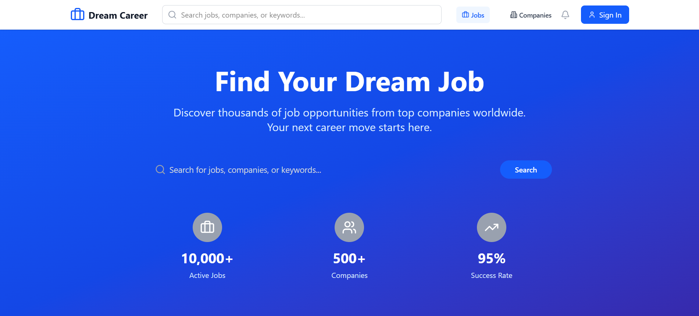

# 🧑‍💼 Online Job Portal

An end-to-end job portal web application built using **React**, **TypeScript**, **Tailwind CSS**, and **Vite**. This platform facilitates job seekers and employers with modern UI, real-time filtering, and smooth navigation. It mimics the core functionality of real-world job sites like Naukri, Indeed, or LinkedIn Jobs but with a simplified approach for learning and demonstration.

---

   
  
   
  

    
     
    
    
    
   
  

  <h3 align="center"> Created a Job Portal with React, TypeScript, Tailwind CSS, and Vite </h3>
   

---

## 📌 Table of Contents

- [Features](#-features)
- [Screenshots](#-screenshots)
- [Tech Stack](#-tech-stack)
- [Folder Structure](#-folder-structure)
- [Getting Started](#-getting-started)
- [Available Scripts](#-available-scripts)
- [Deployment](#-deployment)
- [Contributing](#-contributing)
- [License](#-license)
- [Author](#-author)

---

## 🚀 Features

### For Job Seekers:

- 🔍 Browse and filter job listings by role, company, or location
- 📄 View detailed job descriptions
- 💾 Save/bookmark preferred jobs
- 📝 Apply for jobs through the UI (demo flow)

### For Recruiters:

- ➕ Post new job openings
- 🧾 Manage and edit existing listings
- 👤 View list of applicants (static or API-integrated)

### General:

- 🌗 Light/Dark mode toggle
- ⚡ Real-time search and filtering
- 🧩 Modular component-based UI
- 📱 Fully responsive design for all devices

---

## 🖼️ Screenshots

> _ Coming Soon_

---

## 🛠️ Tech Stack

| Tech                 | Purpose                         |
| -------------------- | ------------------------------- |
| React                | Front-end framework             |
| TypeScript           | Type safety and maintainability |
| Vite                 | Fast bundler and dev server     |
| Tailwind CSS         | Utility-first CSS styling       |
| React Router DOM     | Routing and navigation          |
| Lucide-React         | Modern icons                    |
| Heroicons (optional) | UI icons                        |

---

## 🔗 Useful Links

- [React Documentation](https://reactjs.org/)
- [Tailwind CSS Docs](https://tailwindcss.com/)
- [Lucide Icons](https://lucide.dev/)
- [Vite](https://vitejs.dev/)
- [Vercel](https://vercel.com/)
